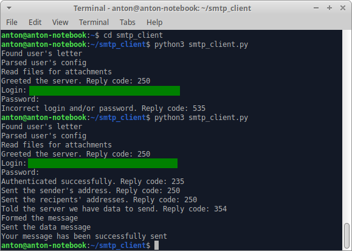
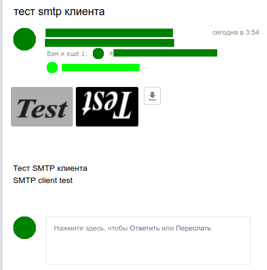

**InternetProtocols-Task5**

Простой SMTP клиент

\
**Как пользоваться:**

В user_files/letter.txt записываем само письмо; адрес отправителя, адрес(а) получателя(ей), тему сообщения и пути к файлам, которые хотим прикрепить, указываем в user_files/config.txt. Адреса отправителей и пути к файлам, если тех и/или других несколько, указываются через запятую без пробелов (без *дополнительных* пробелов между записями; пути к файлам, например, могут содержать пробелы).

После этого запускаем скрипт:

*python3 smtp_client.py*

Для ауентификации в почтовом сервисе спросит логин и пароль.

\
**Пример использования:**

Какие команды/вещи когда посылались на сервер:

"Greeted the server" = "EHLO smtp_client"

"Authenticated successfully" = "AUTH LOGIN", логин в base64, пароль в base64

"Sent the sender's address" = "MAIL FROM: адрес"

"Sent the recipents' addresses" = "RCPT TO: адрес" (несколько раз, если больше одного адреса)

"Told the server we have data to send" = "DATA"

"Sent the data message" = само письмо, включая тему сообщения и вложения

ещё "QUIT" в конце

Что пришло на почту:

\
Коротких Антон МО-201 (МЕН-282201)
